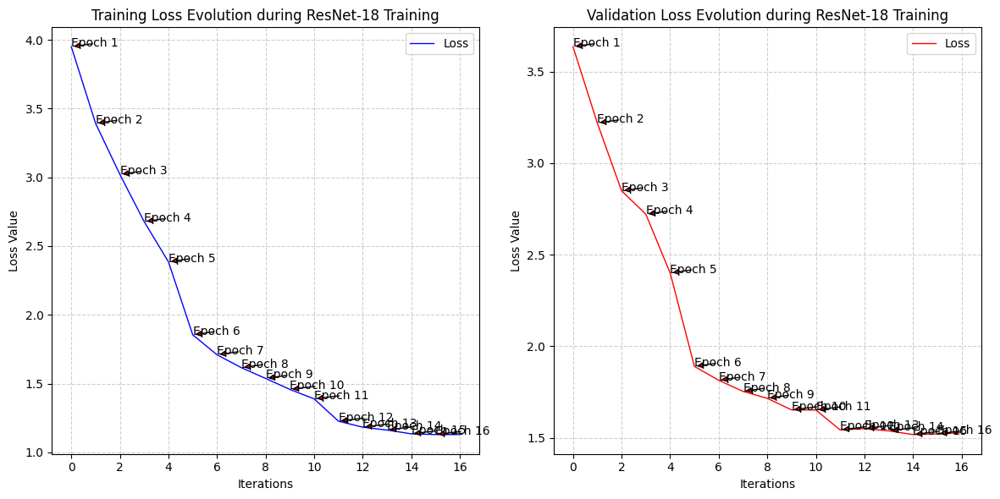
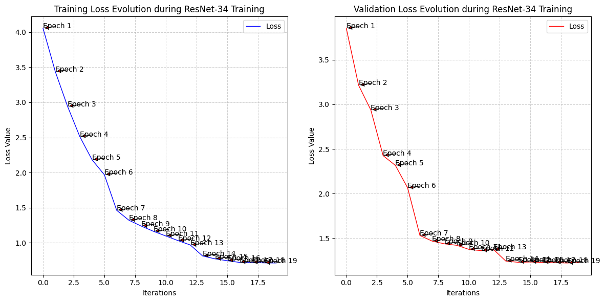

# ResNet_Family-from-scratch in Pure PyTorch
[](https://github.com/pop123-ux/ResNet_Family-from-scratch/actions/workflows/tests.yml)


---


_The ResNet-50 architecture implemented in this project._

This is my in-depth reimplementation of the **ResNet family**, the architecture that changed how very deep convolutional networks could be optimized. It is the third project in my **Visual Scrambling** series, where I reconstruct influential vision architectures before relying on high-level model libraries.

**What “from scratch” means here:** the architectures are reconstructed directly from their design and paper rather than imported from `torchvision.models.resnet*`. Convolution, pooling, linear algebra, optimizers, and autograd still use PyTorch primitives. Selected components—most notably activation functions and Batch Normalization—are implemented manually for educational purposes.

Introduced in 2015 for image recognition, ResNet won the ImageNet Large Scale Visual Recognition Challenge that year and demonstrated that residual learning could make substantially deeper networks practical to optimize.

Residual learning addresses the **degradation problem** observed when deeper plain networks become harder to optimize. Identity shortcuts also create shorter routes through which information and gradients can propagate.

This repository currently implements four ResNet-style architectures, scaling from a deliberately small ResNet-12 variant to a bottleneck-based ResNet-50.

**The main goal** is to understand skip connections, residual blocks, projection shortcuts, feature-map scaling, Batch Normalization, bottleneck blocks, and the transition from shallow CNNs toward genuinely deep architectures.

**A second goal** is to reconstruct the architectures from diagrams and architectural descriptions, then translate those details into explicit PyTorch code rather than hiding them behind a generic model factory.

## Visual Scrambling progression

| Part | Architecture | Historical shift | What I learned |
| :--- | :--- | :--- | :--- |
| `01` | `LeNet-5` | `CNN fundamentals` | `convolution geometry, pooling, RBF output, broadcasting` |
| `02` | `AlexNet` | `deep GPU-era CNNs` | `ReLU, dropout, large feature hierarchies` |
| `03` | `ResNet Family` | `very deep residual networks` | `skip connections, projection shortcuts, BatchNorm, bottlenecks` |

**Visual Scrambling thesis:** understand an architecture deeply enough to reconstruct it before allowing a high-level library to hide its structure.

## Layout

```text
├── .github/
│   └── workflows/
│       └── tests.yml
│
├── IMAGES/
│   ├── The-ResNet-12-architecture.png
│   ├── The-ResNet-18-architecture.png
│   ├── The-ResNet-34-architecture.png
│   └── The-ResNet-50-architecture.png
│
├── checkpoints/
│   ├── ResNet12_cifar100.pth
│   ├── ResNet18_cifar100.pth
│   └── ResNet34_cifar100.pth
│
├── models/
│   ├── __init__.py
│   ├── ResNet_12.py
│   ├── ResNet_18.py
│   ├── ResNet_34.py
│   └── ResNet_50.py
│
├── notebooks/
│   └── test_colab.ipynb
│
├── src/
│   ├── __init__.py
│   └── utils.py
│
├── tests/
│   ├── test_models.py
│   └── test_batchnorm.py
│
├── Theory/
│   ├── BatchNorm.ipynb
│   ├── BottleneckLayers.ipynb
│   ├── Pool_Flatten_Classify.ipynb
│   ├── ResNet-50-Residual_Block.png
│   └── Residual_neural_network.ipynb
│
├── .gitignore
├── LICENSE
├── pyproject.toml
└── README.md
```

## A short math lesson on residual blocks

### Signal propagation

The introduction of identity mappings inside **residual layers** facilitates signal propagation in both forward and backward paths.

### Forward propagation

If the output of the $\ell$-th residual block is the input to the $(\ell + 1)$-th residual block, then:

$$x_{\ell +1} = F(x_{\ell}) + x_{\ell}$$

Applying this formulation recursively:

$$\begin{aligned}
x_{\ell +2} &= F(x_{\ell +1}) + x_{\ell +1} \\
&= F(x_{\ell +1}) + F(x_{\ell}) + x_{\ell}
\end{aligned}$$

which yields the general relationship:

$$x_L = x_{\ell} + \sum_{i=\ell}^{L-1} F(x_i)$$

where $L$ is the index of a deeper residual block and $\ell$ is the index of an earlier block. The identity path therefore creates a direct additive route from shallower representations to deeper ones.

### Backward propagation

Residual learning can also improve gradient flow, but the **vanishing-gradient problem** is not the same thing as the **degradation problem** described in the ResNet paper. Residual learning addresses the optimization degradation observed when increasingly deep plain networks become harder to train; normalization separately helps stabilize optimization.

For a loss function $\mathcal{E}$ and a later residual block $L > \ell$:

$$\begin{aligned}
\frac{\partial \mathcal{E}}{\partial x_{\ell}} &= \frac{\partial \mathcal{E}}{\partial x_L} \frac{\partial x_L}{\partial x_{\ell}} \\
&= \frac{\partial \mathcal{E}}{\partial x_L} \left(1 + \frac{\partial}{\partial x_{\ell}} \sum_{i=\ell}^{L-1} F(x_i)\right) \\
&= \frac{\partial \mathcal{E}}{\partial x_L} + \frac{\partial \mathcal{E}}{\partial x_L} \frac{\partial}{\partial x_{\ell}} \sum_{i=\ell}^{L-1} F(x_i)
\end{aligned}$$

The additive identity term means the gradient is not forced to pass exclusively through every nonlinear transformation in the residual branch.

**Source:** [Wikipedia — Residual Neural Network](https://en.wikipedia.org/wiki/Residual_neural_network)

Residual networks have multiple block variants, including Basic, Bottleneck, and Pre-activation designs. This README stays focused on the variants implemented here; the bottleneck block used by ResNet-50 is discussed in [`Theory/BottleneckLayers.ipynb`](Theory/BottleneckLayers.ipynb).

## The four current architectures

One thing I specifically wanted this repository to show is that **ResNet is not a single architecture—it is a family.**

The same residual-learning principle can be scaled through different block counts, channel widths, and eventually different residual-block designs.

| Architecture | Residual design | Main stage configuration | Final feature width | Role in this repository |
| :--- | :--- | :--- | :--- | :--- |
| ResNet-12 | Custom basic residual blocks | 5 custom blocks | 64 | Small introductory residual model |
| ResNet-18 | Modified basic residual blocks | 4 residual stages | 512 | Transition toward a multi-stage ResNet |
| ResNet-34 | Basic blocks | 3 + 4 + 6 + 3 | 512 | Deep BasicBlock architecture |
| ResNet-50 | Bottleneck blocks | 3 + 4 + 6 + 3 | 2048 | Bottleneck architecture / deepest current implementation |

The implementations are not intended to be interchangeable reproductions of the original ImageNet models. ResNet-12 and ResNet-18 intentionally include educational or experimental deviations, while ResNet-34 and ResNet-50 are much closer to the canonical stage-based designs.

## CIFAR-100 experiments


The recorded training experiments use **CIFAR-100** ([dataset page](https://huggingface.co/datasets/uoft-cs/cifar100)). CIFAR-100 contains 60,000 RGB images across 100 classes:

| Split | Images | Resolution | Channels | Classes |
| --- | ---: | --- | ---: | ---: |
| Train | 50,000 | `32x32` | 3 | 100 |
| Test | 10,000 | `32x32` | 3 | 100 |

I chose CIFAR-100 because it is substantially more manageable than reproducing the original ImageNet experiments while still being difficult enough to expose meaningful differences between the architectures.

These are **recorded experiments rather than a strict apples-to-apples benchmark**. The architectures use different input geometries and preprocessing pipelines, so the table below documents the runs that were actually completed rather than claiming a controlled architecture comparison.

### Recorded CIFAR-100 experiments

**ResNet-12**


**ResNet-18**



**ResNet-34**



**ResNet-50**

ResNet-50 is implemented and covered by the automated forward/backward CI tests, but I did **not** complete a full CIFAR-100 training run for it because I reached the available **Google Colab free-tier GPU compute/session-time limit** while finishing the earlier experiments. The missing checkpoint and metrics are therefore a compute-budget limitation, not an unfinished ResNet-50 implementation.

| Model | Design | Experiment input | Parameters | Val. Loss | Val. Accuracy |
| :--- | :--- | :--- | ---: | ---: | ---: |
| ResNet-12-like | `Custom BasicBlock` | architecture-specific | 377,124 | 3.2480 | 22.63% |
| ResNet-18-like | `Modified BasicBlock` | `100x100` | 11,227,812 | 1.1423 | 61.25% |
| ResNet-34 | `BasicBlock` | `224x224` | 21,335,972 | 1.2320 | 65.04% |
| ResNet-50 | `BottleneckBlock` | `224x224` | 23,712,932 | — | — |

[`notebooks/test_colab.ipynb`](notebooks/test_colab.ipynb) contains the experiment workflow, including dataset loading, model-specific transforms, data loaders, training/validation loss tracking, validation accuracy, and the ResNet-34 confusion matrix.

## Pretrained checkpoints

The repository includes the state dictionaries produced by the completed CIFAR-100 experiments. The `.pth` files are stored under `checkpoints/` and tracked with Git LFS.

| Model | Checkpoint | Classes | Recorded accuracy |
| :--- | :--- | ---: | ---: |
| ResNet-12 | `checkpoints/ResNet12_cifar100.pth` | 100 | 22.63% |
| ResNet-18 | `checkpoints/ResNet18_cifar100.pth` | 100 | 61.25% |
| ResNet-34 | `checkpoints/ResNet34_cifar100.pth` | 100 | 65.04% |
| ResNet-50 | Not distributed | — | — |

Because these checkpoints were trained for CIFAR-100, instantiate the corresponding classifier with `num_classes=100` before loading:

```python
from models import ResNet_34

model = ResNet_34(num_classes=100)
model.load()
model.eval()
```

## Automated tests and CI

The `tests/` suite checks all four model families with CPU-only forward/backward smoke tests, verifies finite gradients and parameter counts, validates the custom BatchNorm behavior, and checks the default checkpoint-path contracts.

Run the same suite locally with:

```bash
python -m pytest tests -q
```

GitHub Actions runs that command automatically on pushes and pull requests to `main`. The badge at the top of this README reflects the latest workflow result.

## Planned expansion

ResNet-50 is **not the intended endpoint** of this repository. I plan to continue scaling the family with **ResNet-101** and **ResNet-152**, which will extend the bottleneck-stage progression and make the repository a broader study of how the same residual design scales with depth.

Those architectures will be added as explicit implementations rather than merely wrapping `torchvision` models. Full training runs will still depend on the practical compute available to the project; architectural implementation, tests, and documented behavior are kept separate from whether a long GPU experiment can be afforded on the Google Colab free tier.

## Lessons learned

In my earlier **LeNet-5-from-scratch** and **AlexNet-from-scratch** repositories, a large part of the challenge was understanding how convolution, pooling, stride, and padding transform tensor dimensions.

ResNet added a new constraint:

**two different computational routes through the network eventually have to meet at the same tensor addition.**

That forced me to understand more deeply why dimensions must line up, why projection shortcuts exist, why `1x1` convolutions are useful, how feature-map depth changes between stages, and how the same residual structure can be repeated many times without turning the architecture into an unreadable stack of unrelated layers.

Implementing Batch Normalization manually also made the distinction between **trainable parameters**, **running statistics**, and PyTorch broadcasting much clearer.

## References

- Kaiming He, Xiangyu Zhang, Shaoqing Ren, and Jian Sun. [Deep Residual Learning for Image Recognition](https://arxiv.org/abs/1512.03385).
- Alex Krizhevsky. [Learning Multiple Layers of Features from Tiny Images](https://www.cs.toronto.edu/~kriz/cifar.html).
- [Residual Neural Network — Wikipedia](https://en.wikipedia.org/wiki/Residual_neural_network)

## Academic citations

**ResNet**

```bibtex
@inproceedings{he2016deep,
 title = {Deep Residual Learning for Image Recognition},
 author = {He, Kaiming and Zhang, Xiangyu and Ren, Shaoqing and Sun, Jian},
 booktitle = {Proceedings of the IEEE Conference on Computer Vision and Pattern Recognition},
 pages = {770--778},
 year = {2016}
}
```

**CIFAR**

```bibtex
@techreport{Krizhevsky09learningmultiple,
    author = {Alex Krizhevsky},
    title = {Learning Multiple Layers of Features from Tiny Images},
    year = {2009}
}
```

## Image credits

Architecture and training visualizations used by the project are stored inside [`IMAGES/`](IMAGES).

Any third-party visual assets included in the repository should retain their original attribution and licensing information and are **not automatically covered by this repository's MIT License**.

## Visual Scrambling

If this project is your first encounter with the series, the previous implementations are available here:

**01 — LeNet-5:** [LeNet_5-from-scratch](https://github.com/pop123-ux/LeNet_5-from-scratch)

**02 — AlexNet:** [AlexNet-from-scratch](https://github.com/pop123-ux/AlexNet-from-scratch)

**03 — ResNet Family:** this repository.

**Understand the architecture before letting a library hide it.**

## 🔗 More

- Author: [Pop Alexandru](https://github.com/pop123-ux)
- Previous project: [AlexNet-from-scratch](https://github.com/pop123-ux/AlexNet-from-scratch)
- Previous project: [LeNet_5-from-scratch](https://github.com/pop123-ux/LeNet_5-from-scratch)
- Medium write-ups: [medium.com/@Pop123](https://medium.com/@Pop123)
- Hugging Face: [pop123ux](https://huggingface.co/pop123ux)
