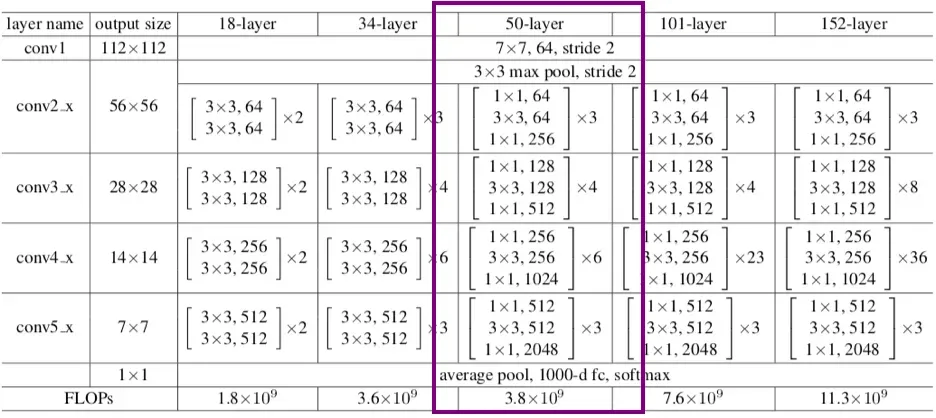
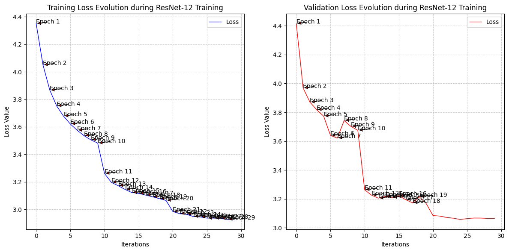

# ResNet_Family-from-scratch in pure PyTorch


My working in-depth reimplementation of revolutionary convolutional neural network family that really put to question, how deep can deep neural networks really go. This is the 3rd project from the **Visual Scrambling** series in which I go through the most influential classic architectures, ending with a unique visual model design written and designed by me.

Developed in 2015 for image recognition, it won the **ImageNet Large Scale Visual Recognition Challenge** of that year.

The novelty of the design consists of adapting a _residual connection_, stabilizing the training and convergence of deep neural networks with dozens to hundreds of layers, contemporarily being expanded to transformer models (such as **BERT**, and **GPT** models--the first ones adopting the "transformer" architecture).

In this work, I implement and study four ResNet-style architectures, scaling from a deliberately small ResNet-12 variant to the Bottleneck-based ResNet-50.

**The main goal** of this repository is understanding skip connections, residual blocks, projection shortcuts, feature-map scaling, Batch Normalization, and the transition from shallow CNNs toward genuinely deep architectures.

**A second goal** was dissecting the ResNet-like architectures solely from the pictures inside [](IMAGES) and translating the thorough graphical details into PyTorch code

## Layout ##

```
├── IMAGES
│   ├── The-ResNet-12-architecture.png # image of the ResNet-12 type architecture implemented   
│   ├── The-ResNet-18-architecture.png # image of the ResNet-18 type architecture implemented       
│   ├── The-ResNet-34-architecture.png # image of the ResNet-34 type architecture implemented   
│   └── The-ResNet-50-architecture.png # image of the ResNet-50 type architecture implemented   
│  
├── models/    # models initialization code and architecture breakdown
│   ├── ResNet_12.py
│   ├── ResNet_18.py
│   ├── ResNet_34.py
│   └── ResNet_50.py
│
├── Theory/


├── src/
│   ├── utils.py # ReLU + LeakyReLU from scratch (the activation functions used in ResNet)
│
│
├── LICENSE # the MIT License of the project
│
├── pyproject.toml # project dependencies
│
├── README.md # repository motivation + learning goals
│   
└── test.ipynb # models training + loss visualization + confusion matrix & classification report computation

```

## Now a short math lesson on Residual Blocks

### Signal propagation

The introduction of identity mappings inside **Residual Layers** facilitates signal propagation in both forward and backward paths.

### Forward Propagation

If the output of the $\ell$-th residual block is the input to the $(\ell + 1)$-th residual block (assuming no activation function between blocks), then the $(\ell + 1)$-th input is:

$$x_{\ell +1} = F(x_{\ell}) + x_{\ell}$$

Applying this formulation recursively, for example:

$$\begin{aligned}
x_{\ell +2} &= F(x_{\ell +1}) + x_{\ell +1} \\
&= F(x_{\ell +1}) + F(x_{\ell}) + x_{\ell}
\end{aligned}$$

yields the general relationship:

$$x_L = x_{\ell} + \sum_{i=\ell}^{L-1} F(x_i)$$

where $L$ is the index of a deeper residual block and $\ell$ is the index of some earlier (shallower) block. This formulation suggests that there is always a signal that is directly sent from a shallower block $\ell$ to a deeper block $L$.

### Backward Propagation

The residual learning formulation provides the added benefit of mitigating the **vanishing gradient problem** to some extent. However, it is crucial to acknowledge that the vanishing gradient issue is not the root cause of the degradation problem, which is tackled through the use of normalization.

To observe the effect of residual blocks on backpropagation, consider the partial derivative of a loss function $\mathcal{E}$ with respect to some residual block input $x_{\ell}$. Using the equation above from forward propagation for a later residual block $L > \ell$:

$$\begin{aligned}
\frac{\partial \mathcal{E}}{\partial x_{\ell}} &= \frac{\partial \mathcal{E}}{\partial x_L} \frac{\partial x_L}{\partial x_{\ell}} \\
&= \frac{\partial \mathcal{E}}{\partial x_L} \left(1 + \frac{\partial}{\partial x_{\ell}} \sum_{i=\ell}^{L-1} F(x_i)\right) \\
&= \frac{\partial \mathcal{E}}{\partial x_L} + \frac{\partial \mathcal{E}}{\partial x_L} \frac{\partial}{\partial x_{\ell}} \sum_{i=\ell}^{L-1} F(x_i)
\end{aligned}$$

This formulation suggests that the gradient computation of a shallower layer, $\frac{\partial \mathcal{E}}{\partial x_{\ell}}$, always has a later term $\frac{\partial \mathcal{E}}{\partial x_L}$ that is directly added. Even if the gradients of the $F(x_i)$ terms are small, the total gradient $\frac{\partial \mathcal{E}}{\partial x_{\ell}}$ resists vanishing due to the added term $\frac{\partial \mathcal{E}}{\partial x_L}$.

***

**Source:** [Wikipedia - Residual Neural Network](https://en.wikipedia.org/wiki/Residual_neural_network)

Residual blocks have been adapted to multiple variants, such as Basic, Bottleneck, and Pre-activation, but for the sake of this not turning into a skip connection course, I'll not break them down here (you can still read more about the one specific type used in ResNet_50-from-scratch [here](Theory/BottleneckLayers.ipynb))

## The 4 architectures

One thing I specifically wanted this repository to show is that **ResNet is not a single architecture.**

**It is a family.**

The same residual-learning principle can be progressively scaled through different block counts, channel widths and, eventually, entirely different residual-block designs.

Architecture	Residual design	Main stage configuration	Final feature width	Role in this repository
ResNet-12	Basic residual blocks	5 custom blocks	64	Smallest / introductory residual model
ResNet-18	Basic residual blocks	4 residual stages	512	Transition toward multi-stage ResNet
ResNet-34	Basic residual blocks	3 + 4 + 6 + 3	512	Deep BasicBlock architecture
ResNet-50	Bottleneck blocks	3 + 4 + 6 + 3	2048	Bottleneck architecture / deepest implementation

The implementations are not all intended to be exact interchangeable reproductions of the original ImageNet models. The earlier models also serve as architectural experiments which make the evolution of the family easier to inspect.

## The CIFAR-100 dataset


The final common benchmark for the models in this repository is **CIFAR-100.** (read more about it [here](https://huggingface.co/datasets/uoft-cs/cifar100))

CIFAR-100 contains 60,000 32×32 RGB images distributed over **100 classes:**

| | Split | Images | Size | Labels |
| --- | --- | --- | --- | --- |
| Train | 50,000 | `32x32` | 3 (RGB) | 100 |
| Val | 10,000 | `32x32` | 3 (RGB) | 100 |

I chose CIFAR-100 because it provides a significantly more manageable environment than reproducing the original full ImageNet experiments while still being difficult enough for differences between the architectures to become visible.

The purpose of these experiments was to observe how increasingly deep residual architectures behave under a shared experimental setting (but of course using different image augmentation transformations, due to the nature of the architectures haveing different input sizes, as were the case for the ResNet_12 model, I name "the Toy" of this experiment, due to the strange input/output format, but also to the expected low validation loss on this dataset——I genuinely wanted to test my torch.nn layer building skills with this one :) )

### Experimental setup

The completed configuration of the repository production is as follows:

| Category | Setting |
| --- | --- |
| Hardware | `NVIDIA Tesla T4` |
| Software | `Python, PyTorch, torchvision` |
| Dataset | `CIFAR-100` |
| Epochs | `20` |
| Batch size | `128` |
| Optimizer | `SGD` |
| Learning Rate | `0.05` |
| Momentum | `0.9` |
| Weight decay | `5e-4` |
| Scheduler | `MultiStepLR` |
| Random Seed | `41` |
| Runtime | `TBD` |

The important part of the final comparison will be ensuring that the models being compared were evaluated under an equivalent setup (except for "the Toy" ResNet_12 model)

### Results + Model Comparison

Current training plots:

**ResNet-12**


**ResNet-18**


**ResNet-34**


**ResNet-50**


Experimental section currently being finalized.

The implementations themselves are already part of the repository, while the final validation-loss measurements, classification metrics, and controlled side-by-side comparison are still being completed.

I would rather leave these values explicitly unfinished than publish numbers produced under slightly different experimental conditions and pretend they form a fair comparison.

The final table will follow approximately this format:

| | Model | Parameters | Val. Loss | Val. Accuracy | Precision | Recall |
| --- | --- | --- | --- | --- | --- | --- |
| ResNet-12 | `TBD` | `TBD` | `TBD` | `TBD` | `TBD` | `TBD` |
| ResNet-18 | `TBD` | `TBD` | `TBD` | `TBD` | `TBD` | `TBD` |
| ResNet-34 | `TBD` | `TBD` | `TBD` | `TBD` | `TBD` | `TBD` |
| ResNet-50 | `TBD` | `TBD` | `TBD` | `TBD` | `TBD` | `TBD` |

`test.ipynb` is intended to additionally expose:

- training and validation loss evolution
- validation accuracy
- confusion matrices
- per-class precision
- per-class recall
- per-class F1-score
- and.. architectural differences between the four networks

I would much rather leave these numbers as TBD temporarily than place results from different training conditions next to each other and pretend they constitute a controlled comparison.

## Lessons learned

In my former **LeNet-5-from-scratch** and **AlexNet-from-scratch** repositories, a large part of the challenge was understanding how convolution, pooling, stride and padding transformed the spatial dimensions of a tensor.

ResNet added a new problem:

**now two completely different routes through the network have to meet again at the same tensor addition.**

That forced me to understand much better why dimensions have to line up, why projection shortcuts exist, why `1×1` convolutions are useful, how feature-map depth changes between stages, and how the same residual structure can be repeated many times without turning the architecture into an unreadable stack of unrelated layers.

Implementing Batch Normalization manually also made the difference between **trainable parameters**, **running statistics**, and PyTorch broadcasting much clearer to me.

## References

- Kaiming He, Xiangyu Zhang, Shaoqing Ren, and Jian Sun. [Original ResNet Paper - Deep Residual Learning for Image Recognition](https://arxiv.org/abs/1512.03385).

- Alex Krizhevsky. [CIFAR Dataset - Learning Multiple Layers of Features from Tiny Images](https://www.cs.toronto.edu/~kriz/cifar.html).

- Additional Reading [Residual Neural Network — Wikipedia](https://en.wikipedia.org/wiki/Residual_neural_network)


## Academic Citations

**ResNet**
```
@inproceedings{he2016deep,
 title = {Deep Residual Learning for Image Recognition},
 author = {He, Kaiming and Zhang, Xiangyu and Ren, Shaoqing and Sun, Jian},
 booktitle = {Proceedings of the IEEE Conference on Computer Vision and Pattern Recognition},
 pages = {770--778},
 year = {2016} }
```
**CIFAR**
```
@misc{imagenette,
  author    = "Jeremy Howard",
  title     = "imagenette",
  url       = "https://github.com/fastai/imagenette/"
}
```

## Image Credits

Architecture and training visualizations used by the project are stored inside [IMAGES](IMAGES).

Any third-party visual assets included in the final repository should retain their original attribution and licensing information and are **not automatically covered by this repository's MIT License.**

## Visual Scrambling

If this project is your first encounter with the series, the previous implementations are available here:

**01 — LeNet-5:**
[LeNet_5-from-scratch](https://github.com/pop123-ux/LeNet_5-from-scratch)

**02 — AlexNet:**
[AlexNet-from-scratch](https://github.com/pop123-ux/AlexNet-from-scratch)

**03 — ResNet Family:**
This repository.

From **LeNet → AlexNet → ResNet**, the goal remains the same:

**understand the architecture before letting a library hide it.**

## 🔗 More

- Author: [Pop Alexandru](https://github.com/pop123-ux)
- Previous project: [AlexNet-from-scratch](https://github.com/pop123-ux/AlexNet-from-scratch)
- Previous project: [LeNet_5-from-scratch](https://github.com/pop123-ux/LeNet_5-from-scratch)
- Medium write-ups: [medium.com/@Pop123](https://medium.com/@Pop123)
- Hugging Face: [pop123ux](https://huggingface.co/pop123ux)
